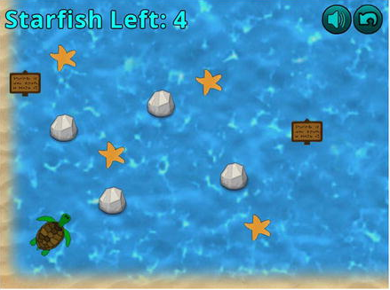

# Starfish Collector

Starfish Collector, where you help the player’s character, a turtle, swim around the ocean floor while looking for a starfish.

Controls

- Left, Right, Up and Down keys: moves the turtle



## How to run the desktop version

Running the source code:

```
./gradlew lwjgl3:run
```

Running the `jar` file:

```
java -jar starfishcollector-{version}.jar
```

## Technologies used

- **Kotlin** 1.6.21: https://kotlinlang.org
- **JDK** Eclipse Temurin 11: https://adoptium.net
- **Gradle** Wrapper 7.4.2: https://gradle.org
- **LigKTX** 11.11.0-rc1: https://libktx.github.io
- **LigGDX** 1.11.0: https://libgdx.com
- **Fleks ECS Library** 1.3-JVM: https://github.com/Quillraven/Fleks
- Project generated with **GDX Liftoff**: https://github.com/tommyettinger/gdx-liftoff

## Disclaimer

This game is the result of reading, studying and learning the examples shown in the book "**Java Game Development with LibGDX**" by the author Lee Stemkoski.

- **Book site**: https://www.apress.com/gp/book/9781484233238
- **Source-code**: https://github.com/Apress/java-game-dev-LibGDX
